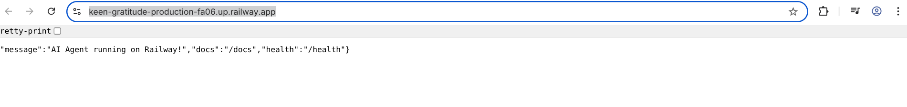

# Day 12 Lab - Mission Answers

## Part 1: Localhost vs Production

### Exercise 1.1: Anti-patterns found
1. Điều gì xảy ra nếu bạn push code với API key hardcode lên GitHub public? 
Lộ API key, ảnh hưởng bảo mật
2. Tại sao stateless quan trọng khi scale? 
Giúp scale dễ dàng hơn, không phụ thuộc vào trạng thái của server
3. 12-factor nói "dev/prod parity" — nghĩa là gì trong thực tế? 
Dev và prod phải giống nhau
...

### Exercise 1.3: Comparison table
| Feature | Develop | Production | Why Important? |
|---------|---------|------------|----------------|
| Config  | Biến cố định (Hardcode) trong code | Environment Variables (`os.getenv`), `config.py` | Bảo mật (không lộ credentials). Môi trường linh hoạt. |
| Logging | Dùng lệnh `print()` | Dùng thư viện `logging`, xuất format JSON | Dễ theo dõi và tìm lỗi trên diện rộng bằng các tool giám sát. |
| Server  | host="127.0.0.1", port=8000 tĩnh | host="0.0.0.0", port động đọc từ `$PORT` | Cho phép truy cập từ mạng ngoài thông qua Reverse Proxy. |
| Debug   | Bật Auto-reload & Tracerint()` để log thay vì một thư viện logging thực thụ, đồng thời vô tình log luôn nội dung biến `OPENAI_API_KEY` ra ngoài console.
3. Hardcode cấu hình server: cổng (`port=8000`) và địa chỉ (`host="localhost"`). Không thể chạy được khi deploy lên cloud vị bị giới hạn IP và port tĩnh.
4. Bật chế độ `reload=True` của uvicorn. Tính năng này chỉ dùng thay đổi code khi dev, trong môi trường prod sẽ làm lãng phí nghiêm trọng tài nguyên.
5. Thiếu Health Check Endpoint (Như `/health`) để nền tảng tự động kiểm tra xem ứng dụng còn chạy hay không. back | Tắt Traceback public, quản lý lỗi chuẩn | Tránh hacker dựa vào Traceback để đọc kiến trúc nội bộ. Tối ưu CPU. |

## Part 2: Docker

### Exercise 2.1: Dockerfile questions
1. Base image: `python:3.11` (Bản image hoàn chỉnh ~ 800MB).
2. Working directory: `/app` (Dùng để chứa code trong folder phân lập thay vì lưu lẫn lộn tại `/`).
3. Tại sao `COPY requirements.txt .` rồi `RUN pip install` TRƯỚC khi `COPY . .`? 
**Trả lời:** Để tận dụng Docker layer cache. Nếu requirements.txt không đổi, Docker sẽ không tải lại thư viện khi code `app.py` bị thay đổi, giúp tăng cường tốc độ build lên siêu tốc. 
4. `.dockerignore` nên chứa gì? 
**Trả lời:** Bỏ mục `.env` (tránh rò rỉ key), `venv/` (tránh mang thư viện rác từ máy host sang container), `__pycache__`.

### Exercise 2.3: Image size comparison
- Develop (`python:3.11` base): ~800 MB
- Production (`python:3.11-slim` base): ~130 MB (Tuỳ số lượng dependecy).
- Difference: Giảm đi ~83.7% dung lượng giúp tải và chạy nhanh, bảo mật cao hơn do có ít package rác và lỗ hổng.

## Part 3: Cloud Deployment

### Exercise 3.1: Railway deployment
- URL: https://keen-gratitude-production-fa06.up.railway.app
- Screenshot: 

## Part 4: API Security

### Exercise 4.1-4.3: Test results
- Thử nghiệm không API Key: Server trả về `HTTP 403 Forbidden` (`{"detail":"Invalid API Key"}`).
- Thử nghiệm gửi Request liên tục (Rate Limit): Server trả về `HTTP 429 Too Many Requests` (Quá giới hạn số lượng request cho phép).
- Thử nghiệm Token Cost Guard: Server trả lời `HTTP 400 Bad Request` nếu prompt đầu vào quá độ dài giới hạn.

### Exercise 4.4: Cost guard implementation
- Trong FastAPI server cần có `rate_limiter.py` để đếm số req từ client trên mỗi IP (sử dụng cache bộ nhớ hoặc database in-memory như Redis).
- `cost_guard.py` được triển khai để chặn nội dung (tính chiều dài chuỗi `len(prompt)`), hoặc xác định `max_tokens` ngắn khi gửi đi request qua LLM để không cho sinh câu trả lời quá dài.

## Part 5: Scaling & Reliability

### Exercise 5.1-5.5: Implementation notes
- Sử dụng nhiều bản sao của App Container phía sau một Reverse Proxy Container tên là Nginx.
- Client thay vì gọi thẳng vào App sẽ gọi vào Nginx. Nginx thực hiện thuật toán cân bằng tải (Load Balancing) round-robin. 
- Ngay khi một App bị die (mất kết nối / error), Nginx tự động cô lập App đó và chỉ chia tải qua App đang khả dụng ➜ Zero Downtime giúp Agent luôn hoạt động, chịu tải song song cực tốt.